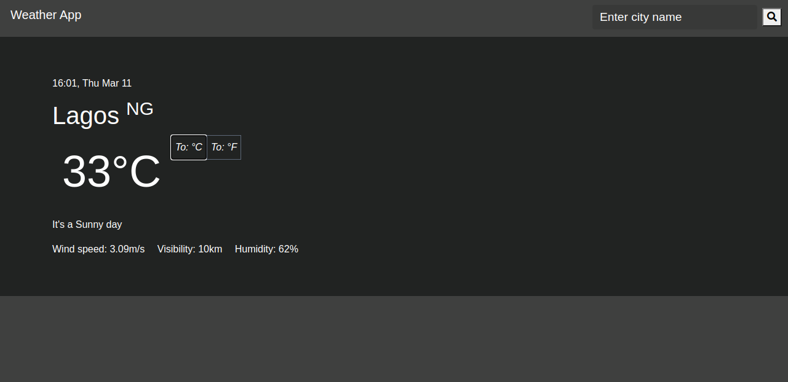

# WEATHER APP

This project is a simple weather app that shows the weather report of a chosen city in any part of the world. A user can enter the name of a city and see the weather conditions.

## Built With
- JavaScript
- Webpack
- HTML & CSS

## Getting Started
To get a copy up and running follow these simple steps:-

- [Clone](https://github.com/Godswilly/weather-app.git) to your local machine.
- cd into the weather-app directory and navigate into the dist directory.
- Open the index.html file with the browser

## Usage
- Clone the project to your local machine
- Run npm install
- npm run watch

### Live Demo
- <a href="https://ecstatic-brahmagupta-51dca7.netlify.app/">Click here

## Author

👤 **Kalu Agu Kalu**

- [Github](https://github.com/Godswilly)
- [Twitter](https://twitter.com/KaluAguKalu17)
- [Linkedin](https://www.linkedin.com/in/kaluagukalu/)

## 🤝 Contributing

Contributions, issues and feature requests are welcome!

Feel free to check the [issues page](https://github.com/Godswilly/weather-app/issues).

## Show your support

Give a ⭐️ if you like this project!

## Acknowledgments
- <a href="https://openweathermap.com">Openweather API </a>

## 📝 License

This project is [MIT](lic.url) licensed.
